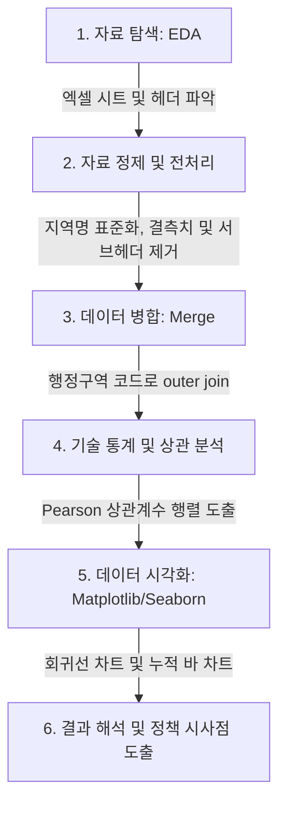

# 데이터 분석 가이드 및 해석 (Data Science Workflow & Guide)

본 가이드는 제공된 5개의 엑셀 데이터를 정제하고 분석하여 시각화 및 최종 해석에 도달하는 전체 데이터 분석 파이프라인(Data Science Pipeline)을 설명합니다. 

이 프로젝트는 자료 탐색(EDA), 데이터 전처리(Data Cleaning), 데이터 병합(Merge), 통계 분석 및 상관분석(Analysis), 시각화(Visualization), 그리고 데이터 기반 해석(Interpretation)의 6단계로 이루어져 있습니다.

---

## 1. 분석 파이프라인 개요

전체 분석 프레임워크는 다음과 같은 흐름으로 진행됩니다:



---

## 2. 단계별 세부 과정 및 분석 코드

### [1단계] 자료 탐색 (EDA)
각 엑셀 파일의 기본 정보를 파악하는 단계입니다. 파일이 바이너리(xlsx) 형식이므로 Python의 `openpyxl` 엔진과 `pandas`를 이용하여 파일 구조를 읽습니다.

```python
import os
import pandas as pd

base_dir = r"c:\Users\user\Desktop\기말"
files = {
    "pop": "행정구역_시군구_별__성별_인구수_20260619101532.xlsx",
    "infra": "인구_십만명당_문화기반시설수_시도_시_군_구__20260619101950.xlsx",
    "sat": "여가활용_만족도_시도__20260619101923.xlsx",
    "unsat": "여가활용_불만족_이유_시도__20260619101939.xlsx",
    "viewing": "문화예술_및_스포츠관람현황_시도__20260619101907.xlsx"
}

# 각 파일 탐색
for name, filename in files.items():
    path = os.path.join(base_dir, filename)
    xls = pd.ExcelFile(path)
    print(f"파일명: {filename} | 시트 목록: {xls.sheet_names}")
    df_temp = pd.read_excel(path, sheet_name="데이터")
    print(f"  - shape: {df_temp.shape}")
```
* **탐색적 발견**: 모든 엑셀 파일은 실제 데이터가 포함된 `'데이터'` 시트와 출처 및 주석을 표기한 `'메타정보'` 시트의 2개 시트로 구성되어 있음을 확인하였습니다.

---

### [2단계] 자료 정제 및 전처리 (Data Preprocessing)
원시 통계표의 특성상 병합 셀로 인한 결측치(`NaN`), 다중 헤더 구조, 수치형 데이터 내의 문자열(예: `'-'`)을 정제하는 과정이 필수적입니다.

#### 1) 행정구역(지역명) 결측치 정제 (`ffill`)
사회조사 엑셀의 경우, 첫 번째 컬럼인 `행정구역별`이 병합되어 있어 첫 행에만 지역명이 있고 나머지 행에는 결측치(`NaN`)가 들어옵니다. 이를 해결하기 위해 앞의 데이터로 빈칸을 채우는 `ffill()`을 적용합니다.
```python
# 행정구역별(1) 컬럼의 빈 셀을 위 지역명으로 채워 넣음
df_sat_raw[df_sat_raw.columns[0]] = df_sat_raw[df_sat_raw.columns[0]].ffill()
```

#### 2) 통계표 내의 서브헤더 및 불필요 조건 필터링
성별, 연령대별 통계가 혼재되어 있으므로, 전체 주민의 대표 지표만 추출하기 위해 `특성별(1) == '전체'`, `특성별(2) == '계'` 조건만 남기고 필터링합니다.

#### 3) 문자열 수치화 및 파생 변수 계산
수치 칼럼을 numeric 타입으로 형변환하고 필요한 비율 및 변화량 지표를 계산합니다.
```python
# 인구 변화량 및 변화율 계산
df_pop["인구_변화량"] = df_pop["2025.12"] - df_pop["2022.01"]
df_pop["인구_변화율_pct"] = (df_pop["인구_변화량"] / df_pop["2022.01"]) * 100

# 여가 만족도 지표 통합 (매우만족 + 약간만족)
df_sat_total["만족도_2025"] = df_sat_total["매우만족_2025"] + df_sat_total["약간만족_2025"]
```

---

### [3단계] 데이터 병합 (Merge)
전처리가 완료된 5개의 데이터셋을 `지역(시도)` 기준으로 병합하여 하나의 통합 데이터프레임을 만듭니다. 행정구역 코드가 일관되게 제공되므로 `지역` 변수를 조인 키(Join Key)로 사용합니다.

```python
m1 = pd.merge(pop_clean, infra_clean, on="지역", how="outer")
m2 = pd.merge(m1, sat_clean, on="지역", how="outer")
m3 = pd.merge(m2, unsat_clean, on="지역", how="outer")
df_final = pd.merge(m3, viewing_clean, on="지역", how="outer")

# '전국' 데이터를 제외하고 지역별 분석 수행
df_regions = df_final[df_final["지역"] != "전국"].copy()
```

---

### [4단계] 상관관계 분석 (Correlation Analysis)
피어슨 상관분석(Pearson Correlation)을 수행하여 핵심 변수 간 선형적 연관성의 강도를 계산합니다.

```python
corr_matrix = df_regions[[
    "인구_변화율_pct", 
    "십만명당_시설수_2024", 
    "만족도_2025", 
    "관람시도율_2025", 
    "2025_여가시설부족"
]].corr()
```

#### 도출된 상관계수 행렬 ($r$)
| 변수명 | 인구 변화율 | 10만명당 시설수 | 여가 만족도 | 문화 관람 시도율 | 여가시설 부족 불만율 |
| :--- | :---: | :---: | :---: | :---: | :---: |
| **인구 변화율** | 1.000 | -0.209 | **0.615** | **0.535** | -0.098 |
| **10만명당 시설수** | -0.209 | 1.000 | -0.089 | **-0.529** | **0.416** |
| **여가 만족도** | **0.615** | -0.089 | 1.000 | **0.758** | -0.109 |
| **문화 관람 시도율** | **0.535** | **-0.529** | **0.758** | 1.000 | -0.404 |
| **여가시설 부족 불만율**| -0.098 | **0.416** | -0.109 | -0.404 | 1.000 |

---

### [5단계] 시각화 (Visualization)
분석 과정에서 도출한 연관성을 파악하기 위해 `seaborn` 라이브러리로 4개의 통계 그래프를 시각화하여 로컬에 저장합니다.

#### 1) 인구 변화율 vs 10만 명당 시설수
* **해설**: 인구가 크게 늘어난 도시 지역일수록 분모(주민등록인구)가 커져 10만 명당 지표는 낮게 분포합니다.
* [시각화 그래프 보기](file:///C:/Users/user/.gemini/antigravity/brain/61c7a00a-2fc1-487d-9053-157f85e4aded/pop_vs_infra.png)

#### 2) 인프라 밀도 vs 여가 만족도
* **해설**: 10만 명당 시설수가 밀집해 있는 지역들이 오히려 여가 만족도가 향상되지 않는 역설이 확인됩니다.
* [시각화 그래프 보기](file:///C:/Users/user/.gemini/antigravity/brain/61c7a00a-2fc1-487d-9053-157f85e4aded/infra_vs_satisfaction.png)

#### 3) 인프라 밀도 vs 관람 시도율
* **해설**: 인프라 밀도가 높은 도 지역 주민들이 적극적인 문화 활동 참여(시도율)는 떨어지는 뚜렷한 반비례 관계를 나타냅니다.
* [시각화 그래프 보기](file:///C:/Users/user/.gemini/antigravity/brain/61c7a00a-2fc1-487d-9053-157f85e4aded/infra_vs_viewing.png)

#### 4) 지역별 여가 불만족 요인 분석
* **해설**: 전국 공통적으로 '경제적 부담'과 '시간 부족'이 압도적이나, 전남/전북/제주 등 도 지역은 서울/부산/인천에 비해 '여가시설 부족'에 의한 불만이 월등히 높음을 드러냅니다.
* [시각화 그래프 보기](file:///C:/Users/user/.gemini/antigravity/brain/61c7a00a-2fc1-487d-9053-157f85e4aded/unsat_reasons.png)

---

## 3. 종합 해석 및 데이터 기반 인사이트

### 1. 인구 증가와 정주 여건으로서의 '여가 환경' ($r = 0.615$)
* 인구 유입이 활발한 지자체(세종, 인천, 경기)는 주민들의 여가 생활 만족도가 높은 수준을 유지합니다. 
* 반면, 영남·호남 권역의 다수 도 지자체들은 청년 인구 이탈과 급격한 고령화에 직면해 있으며, 여가 불만족도가 전국 평균보다 월등히 높아 정주 만족도 하락이 인구 유출을 더욱 가속화하는 악순환 고리가 작동하고 있는 것으로 파악됩니다.

### 2. 양적 공급 지표(시설수)의 한계와 수요 격차
* **10만명당 문화기반시설수**가 많은 지자체(제주 18.90개, 강원 16.50개, 전남 13.60개)들이 실제 주민들의 여가만족도는 30%대에 머물러 만족하지 못하고 있습니다.
* 또한 이들 지역은 **여가 불만족 사유 중 '여가시설 부족' 비율이 최고 4.7%**로 도시 지역(부산 0.8%, 광주 1.0%) 대비 4배 이상 높습니다. 
* **해석**: 이는 주민들이 일상적으로 찾을 수 있는 "접근성 높은 상업적·문화적 여가시설(대형 시네마 극장, 종합 쇼핑 복합시설, 전문 공연 홀 등)"과 자치단체가 건립한 "통계상의 공공 문화기반시설(노후화된 향토 박물관, 소규모 독서실 등)" 간에 심각한 질적 격차가 존재함을 명확히 시사합니다.

### 3. 활발한 관람 활동이 가져오는 여가 효용감 ($r = 0.758$)
* 실제 영화, 공연, 미술 전시 및 프로스포츠 경기 관람에 활발히 시도하는 지자체(관람시도율 1위 세종: 71.0%)가 여가 만족도가 가장 극대화되어 나타납니다.
* 단순히 공간을 지어주는 정책이 아니라, 주민이 선호하고 향유할 수 있는 콘텐츠의 **'다양성'**과 거주지로부터 쉽게 오갈 수 있는 **'물리적 접근성'**을 보장해 주는 것이 여가 삶의 만족도를 실질적으로 향상시킬 수 있는 핵심 정책 요인입니다.
