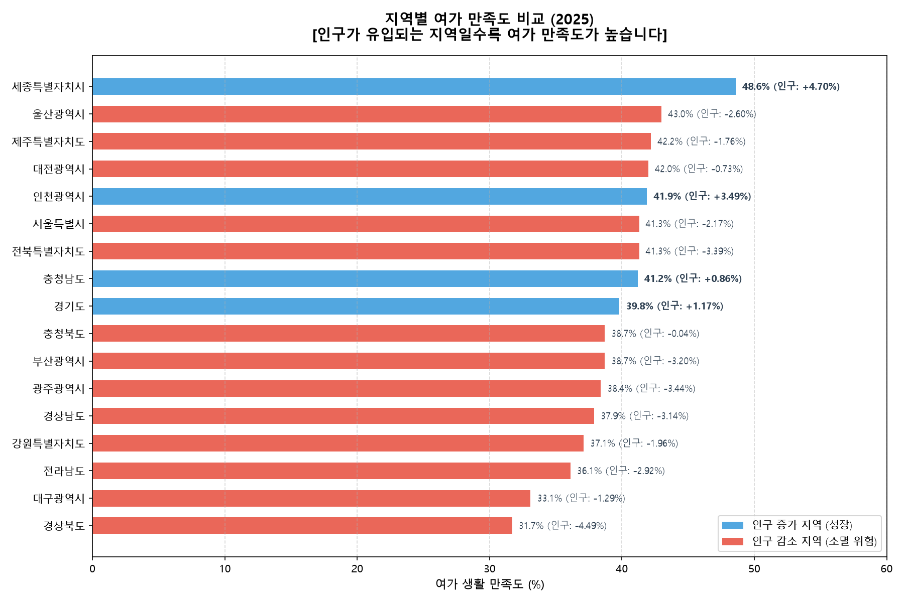
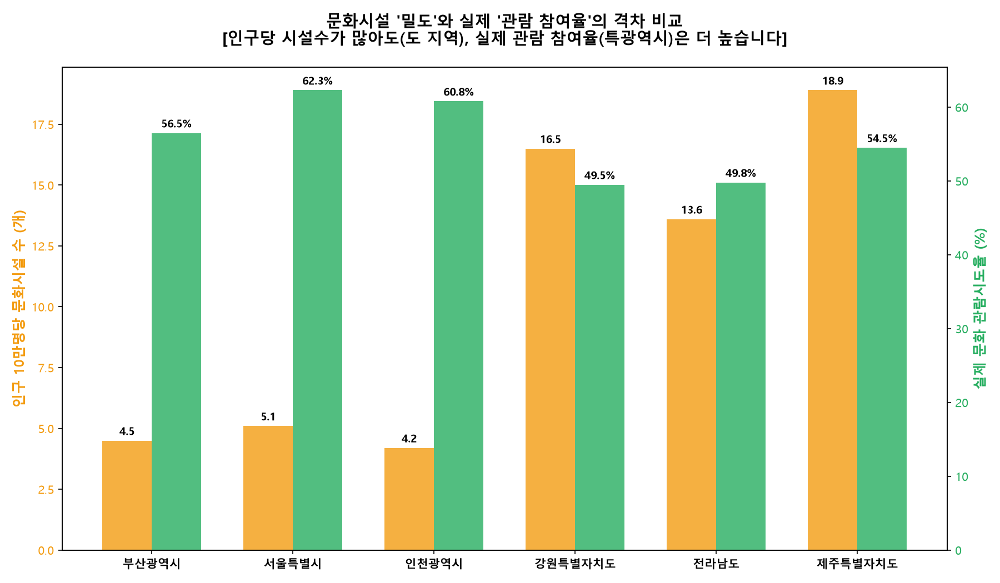
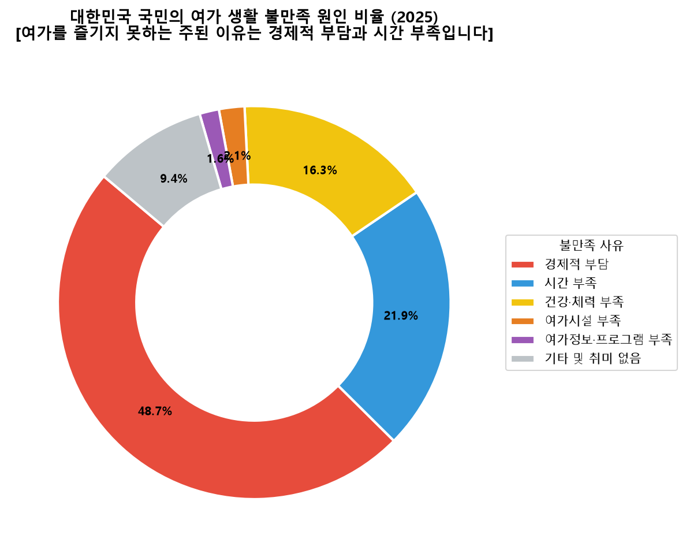
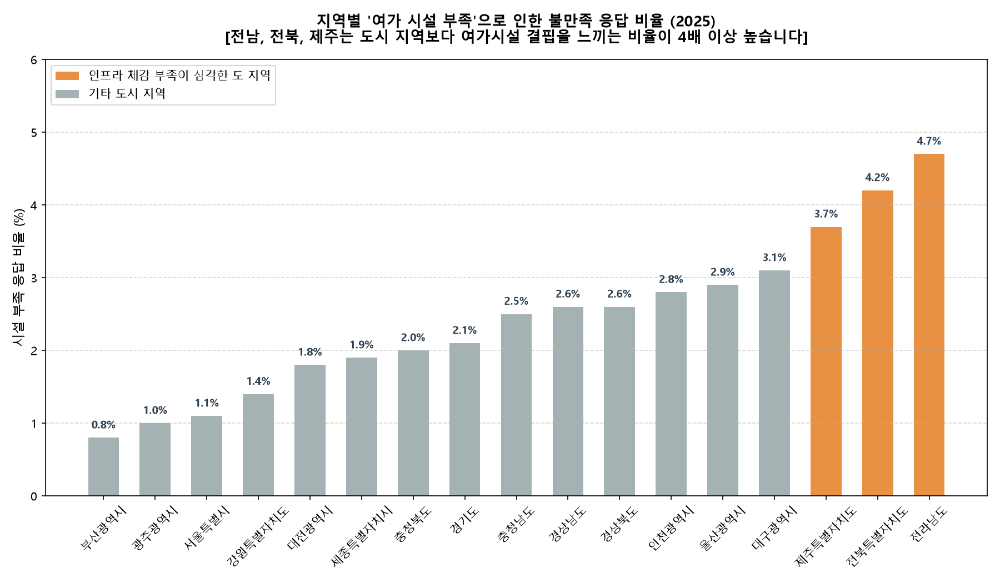
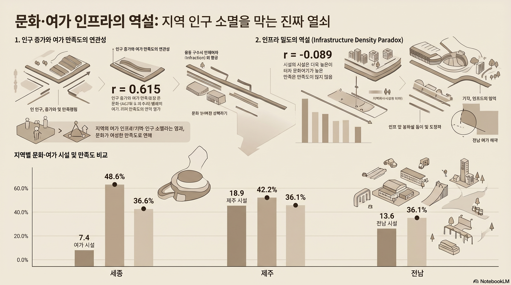

# [공공 데이터 분석 보고서] 문화·여가 생활과 지역별 인구 변화 연관성 분석

**주제:** 양적 공급의 착시와 문화 양극화: 공공 통계 융합 데이터 분석을 통해 본 지역별 여가 만족도와 인구 소멸 연관성 연구  
**소속:** 부산대학교 디자인학과 디지털테크놀로지 전공  
**작성자:** 김진서 (학번: 202366243)  

---

본 보고서는 국가통계포털(KOSIS)에서 수집한 행정안전부 주민등록인구, 문화체육관광부 문화기반시설총람, 통계청 사회조사 데이터를 병합 및 가공하여, 지역 주민의 삶의 질을 대변하는 문화·여가 지표와 인구 증감 간의 유기적 상관관계를 정밀 분석한 연구 결과물입니다.

## 1. 선정한 주제와 선정 이유
* **보고서 제목 (주제):** 양적 공급의 착시와 체감 격차: 공공 통계 융합 데이터 분석을 통해 본 지역별 여가 만족도와 인구 소멸 연관성 연구
* **주제 선정 이유:**  
  최근 일상 속에서 다양한 문화·여가 생활을 직접 진행하고, 특히 부산 콘텐츠 공모전과 같은 대회를 직접 준비하고 참가하면서 지역의 문화, 예술, 관람, 관광 산업이 가진 사회적 가치에 대한 관심도가 크게 높아졌습니다. 이러한 과정에서 주민들이 체감하는 여가 생활의 만족도와 불만족도, 그리고 지역별 문화시설의 개수가 실제로 지방 인구수의 감소 또는 증가와 어떠한 연관성을 가지고 작동하는지 깊은 의문이 생겨 본 주제를 선정하게 되었습니다. 단순한 행정적 인프라 공급을 넘어, 주민 삶의 질을 결정하는 실질적인 여가 환경이 정주 인구 변화에 미치는 영향을 데이터 기반으로 규명하고 정책적 대안을 모색하는 것이 이 연구의 목적입니다.

## 2. 활용한 통계 자료의 출처
본 보고서의 분석은 KOSIS(국가통계포털)를 통해 일괄 수집된 다음 5가지 공공 통계 자료를 바탕으로 데이터 정제 및 병합을 수행하여 작성되었습니다.

1. **인구 현황 데이터**
   * 자료명 및 통계표 이름: 행정구역(시군구)별, 성별 인구수
   * 기관명: 행정안전부 (KOSIS 수집)
   * 기준연도 또는 기간: 2022년 1월 ~ 2026년 5월 (월별 데이터)
   * 참조 파일명: `행정구역_시군구_별__성별_인구수_20260619101532.xlsx`
2. **문화 기반 시설 데이터**
   * 자료명 및 통계표 이름: 인구 십만명당 문화기반시설수(시도/시/군/구)
   * 기관명: 문화체육관광부 문화기반과 (KOSIS 수집)
   * 기준연도 또는 기간: 2022년 ~ 2024년 (연별 데이터)
   * 참조 파일명: `인구_십만명당_문화기반시설수_시도_시_군_구__20260619101950.xlsx`
3. **여가 생활 만족도 데이터**
   * 자료명 및 통계표 이름: 여가활용 만족도(시도)
   * 기관명: 통계청 사회통계기획과 (KOSIS 수집)
   * 기준연도 또는 기간: 2021년 ~ 2025년 (2년 주기, 홀수년 조사)
   * 참조 파일명: `여가활용_만족도_시도__20260619101923.xlsx`
4. **여가 불만족 이유 데이터**
   * 자료명 및 통계표 이름: 여가활용 불만족 이유(시도)
   * 기관명: 통계청 사회통계기획과 (KOSIS 수집)
   * 기준연도 또는 기간: 2021년 ~ 2025년 (2년 주기, 홀수년 조사)
   * 참조 파일명: `여가활용_불만족_이유_시도__20260619101939.xlsx`
5. **문화예술 및 스포츠 관람 데이터**
   * 자료명 및 통계표 이름: 문화예술 및 스포츠관람현황(시도)
   * 기관명: 통계청 사회통계기획과 (KOSIS 수집)
   * 기준연도 또는 기간: 2021년 ~ 2025년 (2년 주기, 홀수년 조사)
   * 참조 파일명: `문화예술_및_스포츠관람현황_시도__20260619101907.xlsx`

## 3. 통계 자료의 주요 내용 정리
KOSIS에서 수집한 원천 데이터를 가공하여 도출한 주요 통계적 사실들은 다음과 같습니다.

### 3.1. 지역별 주민등록인구 변화 추이 (2022.01 ~ 2025.12)
* **양극화 현상:** 지난 4년간 대한민국 지역별 인구 변동은 뚜렷한 양극화를 보였습니다.
* **인구 성장 지역:** 세종특별자치시(+4.70%, +17,588명)와 인천광역시(+3.49%, +102,811명)가 비율 측면에서 가장 높은 인구 증가율을 보였으며, 경기도는 절대 수치에서 가장 많은 인구(+158,685명, +1.17%)를 흡수했습니다.
* **인구 감소 지역:** 경상북도(-4.49%, -117,784명)가 비율 기준 전국에서 인구 감소율이 가장 높았으며, 광주광역시(-3.44%), 전북특별자치도(-3.39%), 부산광역시(-3.20%, -107,274명) 등 광역시 및 농어촌 지역의 유출세가 지속되었습니다.

### 3.2. 인구 10만 명당 문화기반시설수 공급 현황 (2024)
* **행정 통계상의 수치 착시:** 영토가 넓고 인구 밀도가 낮은 도(道) 지역이 대도시에 비해 인구 대비 문화시설 밀도가 압도적으로 높게 집계됩니다.
* **인프라 밀도 상위 지역:** 제주특별자치도(18.90개), 강원특별자치도(16.50개), 전라남도(13.60개) 순으로 수치가 높았습니다.
* **인프라 밀도 하위 지역:** 인천광역시(4.20개), 대전광역시(4.40개), 부산광역시(4.50개), 서울특별시(5.10개) 등 인구가 밀집한 특광역시는 하위권에 머물렀습니다.

### 3.3. 주민 체감 여가 생활 만족도 현황 (2025)
* **만족도가 높은 지역:** 여가 생활에 전반적으로 만족한다고 응답한 주민 비율은 세종특별자치시(48.6%), 울산광역시(43.0%), 제주특별자치도(42.2%) 순이었습니다.
* **만족도가 낮은 지역:** 경상북도(31.7%), 대구광역시(33.1%), 전라남도(36.1%) 순으로 만족도가 낮았으며, 경북과 대구의 여가 불만족도는 각각 16.6%, 19.1%로 전국 최상위권이었습니다.

### 3.4. 문화예술 및 스포츠 관람 시도율 (2025)
* **관람율 상위:** 세종특별자치시(71.0%)가 전국 1위를 차지했고, 울산광역시(62.3%)와 서울특별시(62.3%)가 그 뒤를 이었습니다.
* **관람율 하위:** 경상북도(48.5%), 강원특별자치도(49.5%), 전라남도(49.8%) 등으로 도 지역 주민들의 실제 관람 시도율은 하위권에 머물렀습니다.

### 3.5. 여가 생활 불만족 요인 현황 (2025)
* **전국 공통 요인:** 국민 전체가 여가를 충분히 즐기지 못하는 원인으로 경제적 부담(48.7%)과 시간 부족(21.9%), 건강·체력 부족(16.3%)을 꼽았습니다.
* **'여가시설 부족'의 지역별 격차:** 대도시(부산 0.8%, 광주 1.0%, 서울 1.1%) 주민들은 시설 부족 불만이 1% 내외로 매우 낮은 반면, 지방 도 지역(전남 4.7%, 전북 4.2%, 제주 3.7%) 주민들은 결핍을 체감하는 응답 비율이 대도시 대비 4배 이상 유의미하게 높았습니다.

## 4. 표 또는 그래프를 활용한 시각화
본 프로젝트 과정에서 가공된 데이터 지표들을 직관적으로 전달하기 위해 설계하고 제작한 시각화 결과물들의 명세는 다음과 같습니다.

### [차트 1] 여가 만족도 및 지역 인구 변화율 연계 차트 (가로 바 정렬 차트)

* **설명:** 대한민국 17개 시도의 여가 만족도 순위를 세로 방향으로 정렬하고, 각 지자체의 인구가 지속적으로 유입되는 성장 지역(파란색)인지 유출되는 소멸 위험 지역(빨간색)인지를 색상으로 대비시켜 정주 여건과 삶의 질 체감도의 결합 관계를 보여주는 시각 자료입니다.

### [차트 2] 문화시설 공급 밀도와 실질 관람 시도율 격차 비교 차트 (이중 축 혼합 차트)

* **설명:** 수치상의 공급 수준을 나타내는 '10만 명당 문화기반시설 수'와 주민들의 실제 소비 활동을 나타내는 '문화예술 및 스포츠 관람 시도율'을 특광역시 그룹과 도 지역 그룹으로 묶어 배치하여, 양적 인프라 수치는 높으나 실질적인 향유 수준은 떨어지는 불균형을 시각화한 그래프입니다.

### [차트 3] 전국 기준 여가 불만족 사유 비율 도넛 차트 (전체 요인 분포)

* **설명:** 여가를 충분히 누리지 못하는 전국적인 원인 분포를 한눈에 파악할 수 있도록 도넛형 비율 그래프로 구성하여 경제적 부담 및 시간 부족이 차지하는 절대적인 비중을 보여주는 시각 자료입니다.

### [차트 4] 지역별 '여가시설 부족'에 따른 불만족 체감 비율 정렬 차트 (세로 막대 차트)

* **설명:** 여가 불만족 요인 중 '여가시설 부족'을 꼽은 응답률만을 17개 시도별로 정렬하여, 도 지역 주민들이 대도시 주민에 비해 체감하는 문화 인프라의 양적·질적 결핍 강도가 4배 이상 높음을 가시적으로 입증하는 자료입니다.

### [종합 포스터] 문화·여가 인프라와 지역 인구 소멸 분석 보드 (입체 그래픽 포스터)

* **설명:** 인구 유입과 만족도의 높은 흐름, 공급 수치와 주민 체감 격차 간의 괴리 현상 등을 상징적인 그래픽 디자인과 3D 다이어그램 요소를 결합하여 종합 브리핑하는 수준 높은 완성도의 포스터 형태 시각 자료입니다.

---

## 5. 자료를 통해 발견한 특징 또는 문제점
가공 및 병합된 통합 통계표를 교차 정밀 분석한 결과, 대한민국의 문화 인프라 공급 행정과 지역별 인구 변동 구조 간에 다음과 같은 문제점들이 도출되었습니다.

### 5.1. 인구 증감세와 여가 만족도의 강력한 연관성
* 지속적으로 주민등록인구가 급증하며 성장세를 보인 지역(세종, 인천, 경기 등)은 만족도가 전국 상위권을 기록했습니다. 반면 급격한 인구 유출과 고령화에 직면한 소멸 위험 지역(경북, 전남, 대구 등)은 만족도가 최하위권에 머물렀습니다.
* 이는 지역 주민의 문화·여가 여건(정주 환경)이 단순한 복지 차원을 넘어, 인구 이탈을 차단하고 지역의 매력을 높이는 실질적인 정주 요인으로 작동하고 있음을 강력하게 시사합니다.

### 5.2. 수치상의 시설 공급과 주민들이 체감하는 여가의 질 간의 괴리 현상
* 가장 중대한 문제점은 '인구 10만 명당 문화시설 수'가 가장 많았던 제주, 강원, 전남 주민들의 여가 생활 만족도가 오히려 최하위권인 30%대에 머물렀다는 사실입니다. 통계적인 시설 수 밀도와 실제 주민들이 느끼는 만족도 사이에는 아무런 긍정적 상관관계가 존재하지 않았습니다.
* 농어촌 도 지역은 지방자치단체의 예산 집행에 따라 소규모 공공 미술관이나 향토 박물관 등이 지어져 '수치상' 공급 밀도만 높게 계산될 뿐, 주민들이 일상 속에서 정당하게 비용을 지불하고 즐기고 싶어 하는 현대적인 여가 수요와는 심각한 불일치가 나타나 만족도로 직접 이어지지 못하는 구조적 모순이 관찰됩니다.

### 5.3. 인프라 수치와 실제 적극적인 문화소비(관람 시도) 간의 비례 격차
* 10만 명당 시설 수가 4~5개에 불과해 통계적으로는 척박해 보이는 특광역시(서울, 부산, 인천 등) 주민들은 실질적인 영화, 공연, 전시 등의 관람율이 56%~62%를 크게 웃돌며 활발하게 문화를 즐겼습니다.
* 반면 수치상 인프라 밀도가 2~4배 이상 넉넉해 보였던 도 지역(경북, 강원, 전남) 주민들의 실질적인 문화 활동 참여율은 최하위권에 정체되어 정반대의 모습을 보였습니다. 영토가 넓어 도보나 차량으로 도달하기 어려운 물리적 접근성 한계와, 주민이 정작 보고 싶어 하는 고품질 핵심 콘텐츠(멀티플렉스 극장, 프로스포츠 구장, 전문 예술 대형 공연 시설 등)의 질적 공급 부재가 결합하여 나타난 현상입니다.

### 5.4. 풍요 속의 빈곤: 도 지역 주민들의 높은 '시설 부족' 불만율
* 통계상 문화시설 수가 많다고 파악된 지차체일수록, 주민들이 체감하는 "여가시설이 부족하다"는 응답 비율이 왜곡되어 높게 나타나는 현상이 확인되었습니다. 대도시는 이 불만 비율이 1% 내외에 불과한 데 반해, 전남(4.7%)이나 전북(4.2%) 등 지방 도 지역 주민들은 4배 이상 높게 불만을 체감하고 있었습니다.
* 공공 중심의 노후화된 정적 인프라 공급에만 치중할 뿐, 정작 지역 내 주민들이 머물며 즐길 만한 동적 문화 여가 환경(영화관, 스포츠 체육 시설 등)이 절대적으로 부족해 도민들이 일상 속에서 체감하는 박탈감이 대도시에 비해 월등히 크다는 증거입니다.

---

## 6. 생성형 AI를 활용한 과정
프로젝트 수행 과정에서 데이터 분석 생산성을 극대화하기 위해 각 단계에 최적화된 복수의 AI 모델들을 전략적으로 도입하는 멀티 워크플로우를 가동했습니다.

1. **자료 탐색(EDA) 및 데이터 수집 단계 (Gemini 3.5 Flash 활용):** KOSIS(국가통계포털)의 방대한 데이터베이스 내에서 비교 분석에 가장 적합한 주민등록인구 시계열, 문화체육관광부의 인프라 데이터, 통계청의 사회조사 통계표를 정확하게 매칭하고 신속하게 수집하기 위한 지식 검색 및 데이터 분류 가이드를 획득하는 데 활용했습니다.
2. **통계 분석, 해석 및 정밀 그래프 생성 단계 (Antigravity 활용):** 서로 규격이 다른 5가지 원천 엑셀 파일들을 '지역' 변수를 키 값으로 하여 결합하는 파이썬 판다스 스크립트를 작성하고 피어슨 상관분석 연산을 안정적으로 수행하는 파이프라인을 구축했습니다. 또한, 분석을 통해 도출된 변수 간 비례 및 반비례 계수의 통계학적 결론을 정밀 도출하는 데 적극 활용했습니다.
3. **인포그래픽 이미지 및 시각 미디어 제작 단계 (NotebookLM 활용):** Antigravity를 통해 해석 완료된 텍스트 가이드와 수치 지표들을 종합 지식 소스로 입력하여, 핵심 흐름 및 메커니즘을 입체적인 3D 그래픽 다이어그램 요소를 결합한 고급 인포그래픽 디자인 시각화 파일(`문화·여가_인프라와_인구_소멸.png`)로 구조화하고 관련 미디어 산출물을 제작하는 데 활용했습니다.
4. **최종 웹 대시보드 디자인 및 반응형 구현 단계 (Gemini 3.5 Flash 활용):** 가공 완료된 최종 데이터 팩트를 사용자가 직관적으로 탐색할 수 있도록 다크 네이비 테마 기반의 반응형 글래스모피즘(Glassmorphism) 카드 디자인을 설계했습니다. 자바스크립트를 사용하여 시도를 선택하면 상세 수치와 맞춤형 진단 텍스트가 동적으로 갱신되는 반응형 대시보드 웹 파일(`index.html`)을 마크업하고 구성하는 데 활용했습니다.

---

## 7. AI가 제시한 내용 중 수정하거나 보완한 부분
생성형 AI 모델들은 초기 모델 기획과 대시보드 소스코드 설계 시 공공 행정 통계의 실제 개설 형태나 분석 정밀도 측면에서 한계를 드러냈으며, 이에 분석가가 직접 검증하여 완성도를 정정하고 보완했습니다.

### 1) KOSIS 데이터 가용성 판단 및 기획 전면 수정
* **AI의 최초 제시:** AI는 지자체별 문화·여가 투자 예산을 검증하기 위해 각 지자체의 '문화 투자 예산 재무제표 및 결산 자료'를 수집하여 비교 연동할 것을 제안했습니다.
* **분석가의 수정:** 그러나 KOSIS에서 검색해 본 결과, 시도별로 일관되게 비교 가능한 표준화된 재무 재표 자료가 개설되어 있지 않은 통계 부재 현상을 직접 확인했습니다. 이에 기획 오류를 바로잡고, KOSIS에서 명확한 공식 데이터셋을 제공하는 여가 만족도, 불만족 이유, 적극적인 문화예술 관람율 통계 자료로 근거를 전면 수정하여 연구의 신뢰성을 확보했습니다.

### 2) '문화기반시설수' 엑셀 데이터의 주도적 추가를 통한 정확도 향상
* **AI의 최초 제시:** AI는 지역별 총인구수와 실제 관람율, 여가 생활 만족도/불만족도 표의 4개 엑셀 지표만 융합해도 인구 변동 메커니즘 분석이 충분하다고 조언했습니다.
* **분석가의 보완:** 그러나 주민 만족도를 좌우하는 '물리적인 인프라 공급 수준' 변수가 빠져 있어 분석의 객관적 설득력이 낮아질 위험이 있었습니다. 이에 분석가 주도로 '인구 십만명당 문화기반시설 수' 엑셀 데이터를 추가 확보하여 데이터셋을 5종으로 확장했습니다. 이를 통해 수치상 양적 밀도가 높음에도 주민 만족도는 반대로 작용하는 왜곡 현상을 논리적으로 빈틈없이 규명할 수 있었습니다.

### 3) 웹 UI/UX 지식을 기반으로 한 대시보드 디자인 레이아웃 및 사용성 보완
* **AI의 최초 제시:** AI가 일차적으로 디자인하고 마크업해 준 웹 대시보드는 기본적인 정보 배열에 초점이 맞추어져 있어, 시각적인 통일감이나 사용자 입장에서의 화면 흐름(Layout) 및 직관성이 부족했습니다.
* **분석가의 수정:** 제가 보유하고 있는 웹 UI/UX 관련 지식을 바탕으로 대시보드 디자인을 대대적으로 개편했습니다. 전체적으로 어지럽고 투박했던 레이아웃을 좀 더 깔끔하고 세련된 디자인으로 수정 및 보완했으며, 색상 대비와 글꼴 배치를 다듬어 정보 피로도를 낮췄습니다. 추가로 상관관계 테이블을 마우스로 클릭하면 각 지표의 직관적인 설명이 바로 연동되도록 상호작용성(Interaction)을 강화하여, 사용자가 통계 데이터를 한눈에 쉽게 탐색할 수 있도록 완성도를 높였습니다.

---

## 8. 본인의 최종 해석과 결론
KOSIS를 통해 수집한 인구, 인프라, 만족도 통계 자료를 융합하여 분석한 결과, 주민의 문화·여가 삶의 질이 지역의 소멸을 막고 성장세를 유지하는 정주 여건의 핵심 요인으로 작동하고 있다는 명확한 결론에 도달했습니다.

### 8.1. 정주 인구 규모를 결정하는 진짜 열쇠, '체감형 여가 환경'
* **인구 증감과 여가의 연관성:** 지역별 인구 변화율과 주민들의 여가 생활 만족도는 매우 밀접하고 강력한 연관관계를 나타냈습니다. 이는 정주 인구가 늘어나는 성장 지역일수록 여가 환경에 대한 만족도가 높고, 반대로 인구 유출이 심각한 소멸 위험 지역일수록 여가 만족도가 최하위권에 정체되는 현상을 정량적으로 증명합니다.
* **양보다 중요한 킬러 콘텐츠:** 여가 만족도를 결정하는 가장 강력한 요인은 단순히 행정 통계상에 잡히는 문화시설의 개수가 아니라, 주민들이 일상 속에서 쉽게 영화, 대형 공연, 프로스포츠 경기 등을 직접 관람하고 향유할 수 있는 환경이었습니다. 결국 주민들의 실질적인 접근성과 킬러 콘텐츠의 보장이 정주 만족도를 올리고 지역 인구를 유지하는 진짜 매커니즘입니다.

### 8.2. 공급자 중심 행정의 허점과 '질적 수요'의 괴리
* **양적 공급 정책의 한계:** 공공 도서관이나 향토 미술관 등 단순한 '양적 시설 수'만 늘리는 정책은 주민 만족도 제고에 전혀 기여하지 못한다는 점을 발견했습니다. 인구 대비 시설의 개수가 많다고 해서 만족도가 상승하는 선형적인 관계는 존재하지 않았습니다.
* **양적 공급과 주민 체감 간의 괴리 현상:** 오히려 공급자 중심으로 지어진 노후화된 공공시설은 주민들이 원하는 현대적·상업적 문화 수요를 충족시키지 못해, 인구 대비 시설 수가 많은 도 지역 주민들에게 대도시보다 최대 4배 이상 높은 '여가시설 부족'이라는 역설적인 불만족도만 가중시키는 부작용을 낳았습니다.

### 8.3. 최종 결론 및 제언: 주민 중심의 소통형 문화 행정
* **수요자 중심 정책으로의 전환:** 문화시설을 증설하고 인프라를 유치할 때 행정 편의주의적인 공급을 지양하고, 지역 주민과 청년 학생들의 목소리를 적극적으로 반영하는 소통형 행정으로 전환해야 합니다.
* **시민 맞춤형 인프라 구축:** 심층 인터뷰, 시민 투표, 정밀한 수요 통계 조사를 통해 지역 사회가 진짜로 원하고 갈망하는 핵심 시설(멀티플렉스, 문화 복합 상업 인프라 등)을 선별하여 집중 유치해야 합니다. 사용자인 주민의 눈높이에 맞춘 정책만이 예산 낭비를 막고 지역의 정주 가치를 높이는 유일한 해법입니다.

---

## 9. 이번 활동을 통해 알게 된 점 또는 느낀 점
이번 프로젝트는 KOSIS의 실제 공공 데이터셋들을 직접 정제하고 결합해 보면서, 행정 통계 이면에 숨겨진 사회적 모순과 데이터 과학의 가치를 깊이 있게 깨닫는 소중한 계기가 되었습니다.

첫째, 국가나 지자체가 발표하는 '수치상의 풍요'가 실제 주민들이 체감하는 '삶의 질'과 완전히 다를 수 있다는 통계적 착시를 직접 목격하며 큰 깨달음을 얻었습니다. 인구 대비 문화시설의 개수가 많음에도 도민들이 느끼는 문화적 결핍감과 시설 부족 불만이 대도시보다 훨씬 높다는 '수치상의 시설 공급과 주민들이 체감하는 여가의 질 간의 괴리 현상'을 코딩과 전처리 분석으로 직접 검증해 내면서, 사회 현상을 편견 없이 바라보는 데이터 기반 사고의 중요성을 알게 되었습니다.

둘째, 지역 주민들과 청년 학생들의 의견을 적극적으로 수렴하는 거버넌스의 중요성을 절감했습니다. 단순히 건물을 짓는 행정을 지나, 시민들이 원하는 콘텐츠를 인터뷰나 투표로 파악해 유치하는 것이 지역 소멸을 막는 정주 여건 개선의 핵심임을 알게 되었습니다. 이러한 수요자 중심의 소통이 이루어져야만 주민들이 실제로 머무르고 싶어 하는 활력 있는 지역 사회를 만들 수 있습니다. 더불어, 이 과정 속에서 최근 각 지자체와 지역 사회가 주민이나 청년들의 아이디어를 빌려 지역의 독창적인 스토리 및 로컬 콘텐츠를 발굴하고 대외적으로 알릴 수 있는 대회나 공모전을 왜 이토록 활발하게 개최하고 있는지 그 실제적인 이유와 필요성을 깊이 이해하게 되었습니다.
