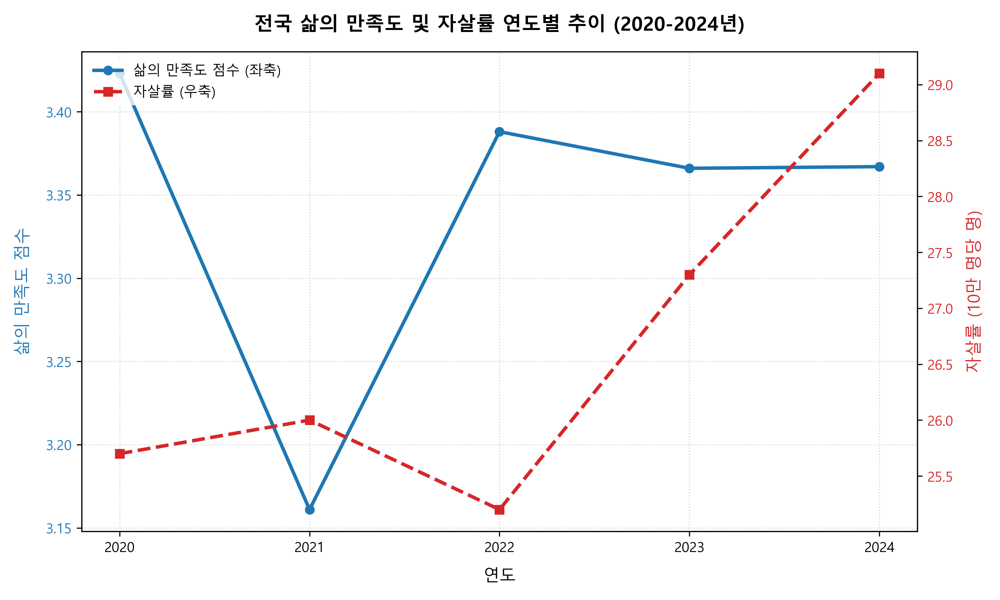
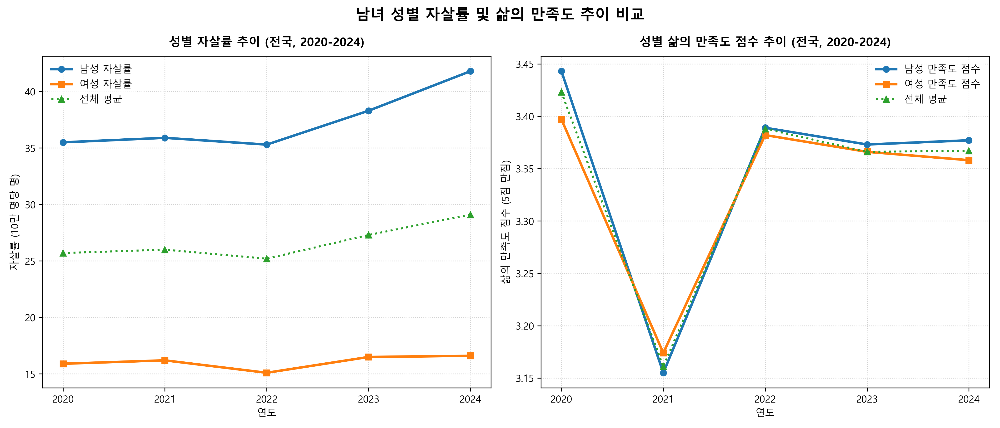
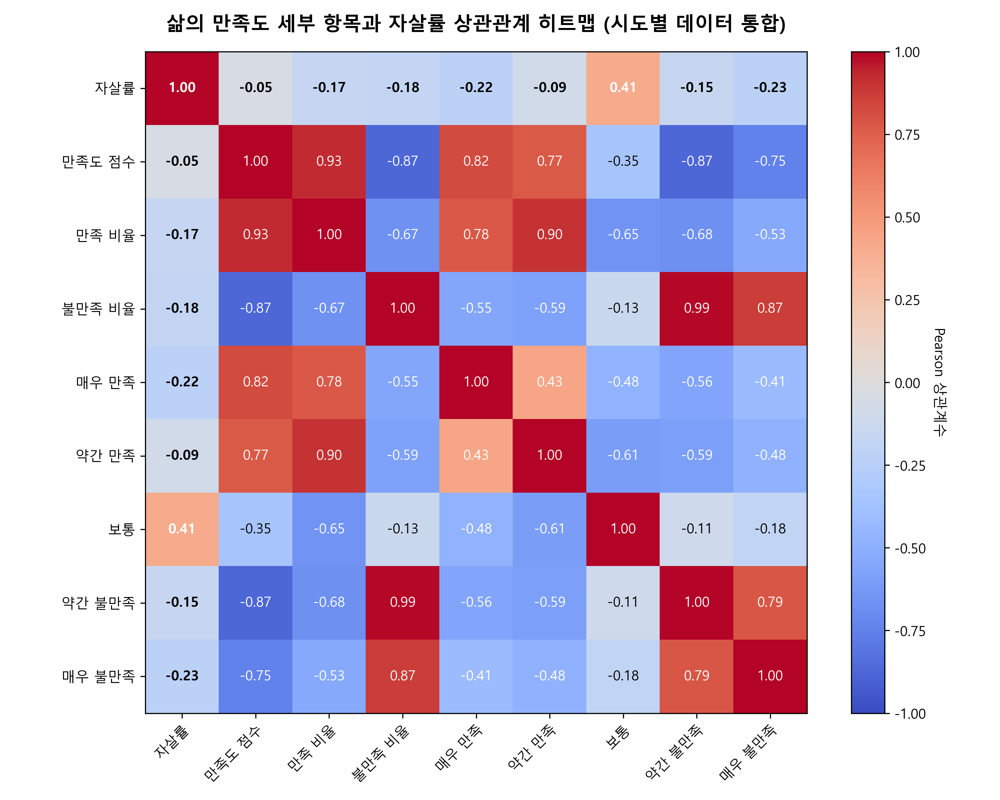
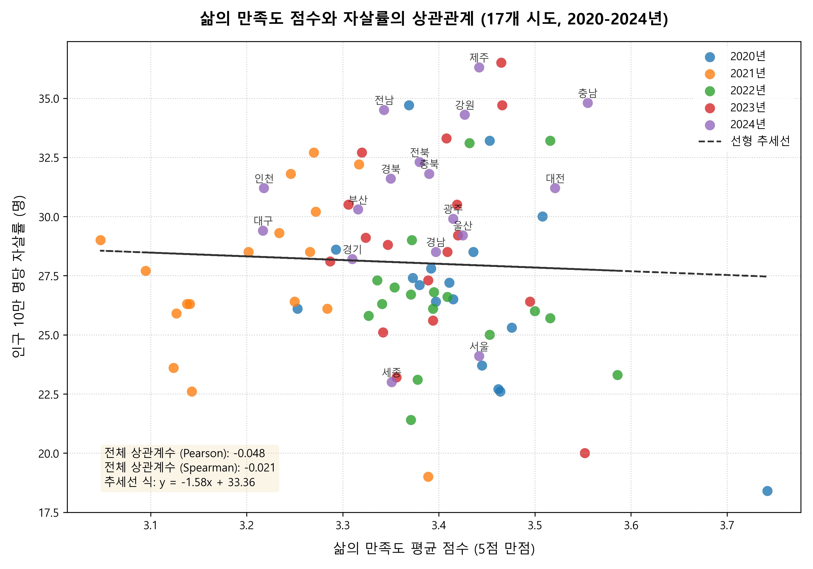
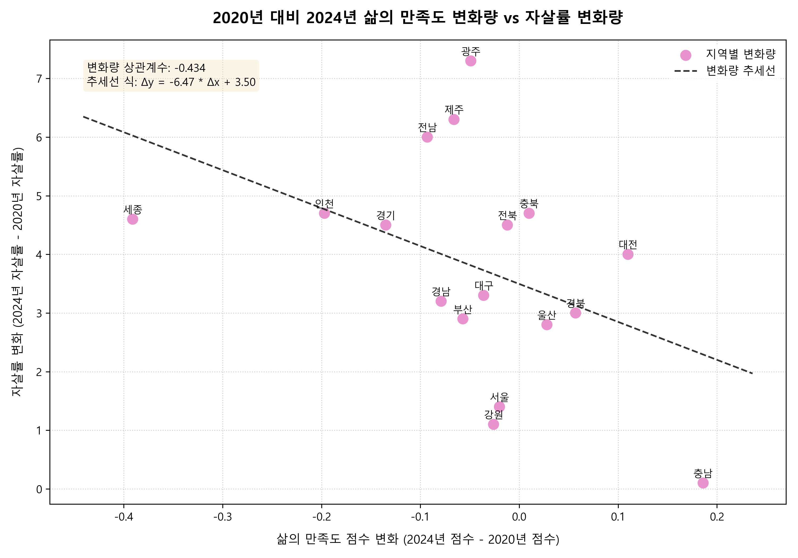
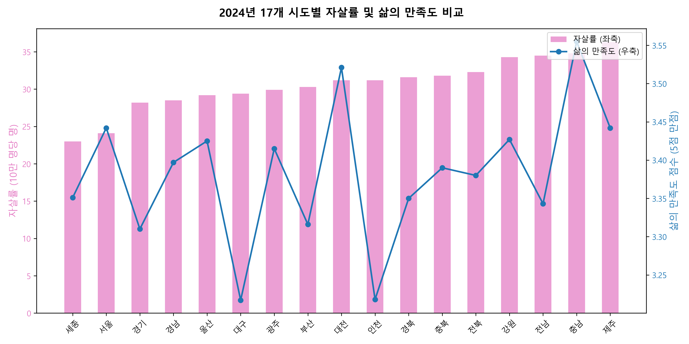

# 🇰🇷 대한민국 시도별 삶의 만족도와 자살률 상관관계 분석 보고서 (2020~2024)

본 보고서는 대한민국 시도별 삶의 만족도 조사 결과와 인구 10만 명당 자살률 데이터를 통합하여, 주관적 웰빙(Well-being) 지표와 극단적 사회적 선택 지표 간의 통계적 상관관계를 규명하고 시사점을 도출하기 위해 작성되었습니다.

---

## 1. 요약 (Executive Summary)

* **자살률의 전국적 상승**: 2020년부터 2024년까지 대한민국의 **17개 모든 시도에서 자살률이 상승**했습니다. 전국 평균 자살률은 2020년 25.7명에서 2024년 29.1명으로 **13.2% 증가**했습니다.
* **삶의 만족도 감소**: 동일 기간 동안 17개 시도 중 **13개 지역에서 주관적 삶의 만족도가 감소**했습니다. 특히 코로나19 팬데믹이 정점에 달했던 2021년에 만족도가 크게 하락한 이후 일부 회복되었으나, 초기 수준을 회복하지 못한 지역이 다수 존재합니다.
* **상관관계의 변화와 괴리**: 
  - **2020년**: 지역별 삶의 만족도와 자살률 간에는 뚜렷한 **음의 상관관계(Pearson r = -0.5135)**가 존재했습니다. 즉, 삶의 만족도가 높은 지역일수록 자살률이 낮았습니다.
  - **2021~2024년**: 코로나19 이후 이 상관관계가 점차 약화되거나 소멸하는 양상을 보였습니다. 2024년에는 삶의 만족도 점수와 자살률 간의 단순 상관관계가 오히려 **약한 양의 상관관계(r = +0.2296)**를 기록하는 이례적 현상이 나타났습니다.
* **시간 경과에 따른 실질적 인과성 규명**:
  - 단년도 크로스섹션(횡단면) 분석에서는 양의 상관관계가 나타나는 모순이 발생했으나, **5년간 각 지역의 '삶의 만족도 변화량'과 '자살률 변화량' 간의 상관관계를 분석한 결과 뚜렷한 음의 상관관계(r = -0.4336)**가 도출되었습니다.
  - 즉, **특정 지역에서 삶의 만족도가 크게 감소할수록 그 지역의 자살률은 더 가파르게 상승**했다는 사실이 통계적으로 입증되었습니다. 이는 만족도 하락이 실제 자살률 상승의 유의미한 선행 지표임을 보여줍니다.

---

## 2. 분석 데이터 및 방법론 (Data & Methodology)

### 2.1. 데이터 출처 및 가공
* **삶의 만족도 데이터**: [삶의_만족도_시도__20260606195059.xlsx](./자살률_삶만족도/삶의_만족도_시도__20260606195059.xlsx)
  - 매년 지역 주민들을 대상으로 삶의 만족 수준을 5개 범주('매우 만족', '약간 만족', '보통', '약간 불만족', '매우 불만족')로 설문 조사한 비율(%) 데이터입니다.
* **자살률 데이터**: [인구십만명당_자살률_시도_시_군_구__20260606194913.xlsx](./자살률_삶만족도/인구십만명당_자살률_시도_시_군_구__20260606194913.xlsx)
  - 인구 10만 명당 자살 사망자 수(명)에 대한 통계청 자료입니다.
* **행정구역 명칭 표준화**: 두 데이터 간 불일치하는 행정구역명을 통일했습니다. (예: '전북특별자치도' ↔ '전라북도' → '전북', '제주특별자치도' ↔ '제주도' → '제주')

### 2.2. 주요 분석 지표
분석의 신뢰도를 높이기 위해 삶의 만족도 비율 데이터를 아래와 같이 3가지 지표로 변환 및 합성하였습니다.
1. **삶의 만족 비율 (%)**: `매우 만족` + `약간 만족` 비율의 합
2. **삶의 불만족 비율 (%)**: `약간 불만족` + `매우 불만족` 비율의 합
3. **평균 만족도 점수 (5점 만점)**: 각 응답 범주에 가중치(매우 만족=5, 약간 만족=4, 보통=3, 약간 불만족=2, 매우 불만족=1)를 부여하여 산출한 가중평균값.

---

## 3. 전국 단위 추이 및 성별 분석 (Nationwide Trends & Gender Analysis)

대한민국 전체(전국 평균)의 5년간 지표 추이를 살펴보면, 삶의 만족도와 실제 자살률 간의 격차가 드러납니다.

| 연도 (Year) | 평균 만족도 점수 (5점 만점) | 삶의 만족 비율 (%) | 삶의 불만족 비율 (%) | 인구 10만 명당 자살률 (명) |
| :---: | :---: | :---: | :---: | :---: |
| **2020** | 3.423 | 42.7 | 12.5 | 25.7 |
| **2021** | 3.161 | 34.0 | 22.9 | 26.0 |
| **2022** | 3.388 | 43.3 | 14.1 | 25.2 |
| **2023** | 3.366 | 42.2 | 14.5 | 27.3 |
| **2024** | 3.367 | 40.1 | 12.7 | 29.1 |

### 📈 전국 삶의 만족도 및 자살률 연도별 추이 (총괄)

### 📈 남녀 성별 자살률 및 삶의 만족도 추이 비교

> **성별 트렌드 분석 및 성별 격차**:
> * **자살률의 극심한 남녀 격차**: 전 기간 동안 **남성의 자살률이 여성의 자살률보다 2배 이상 높게 유지**되고 있습니다. (2024년 기준 남성 자살률 41.8명 vs 여성 자살률 16.6명)
> * **만족도 지표의 유사성**: 그러나 주관적으로 느끼는 삶의 만족도 점수는 남녀 간 유의미한 격차가 나지 않거나 오히려 남성이 미세하게 높은 경향을 보입니다.
> * **시사점**: 주관적인 만족도는 성별 간 비슷하지만 극단적 행동(자살)으로 이어지는 빈도는 남성이 압도적으로 높다는 점은, 남성이 경제적 실패나 실직 등 극단적 위기 상황에 처했을 때 사회적 안전망과 심리적 지지 기반이 더 취약하게 작동하고 있음을 의미합니다.

---

## 4. 시도별 상관관계 분석 (Correlation Analysis)

17개 시도의 5개년 데이터를 기반으로 상관관계 분석을 실시했습니다.

### 4.1. 삶의 만족도 세부 항목과 자살률 상관관계 히트맵
17개 시도 × 5개년 = 총 85개 관측치를 결합하여 분석한 상관계수 행렬입니다.

> **세부 항목별 상관관계 특징**:
> * **'보통' 응답과 자살률의 강한 양의 상관관계(r = +0.41)**: 만족도 조사에서 '보통(중립)'이라고 응답한 비율이 높은 지역일수록 자살률이 뚜렷하게 높은 흥미로운 현상이 발견되었습니다. 이는 삶의 질이 긍정적이지도 부정적이지도 않은 상태, 즉 사회적 활력 상실과 무기력감(Apathy)이 자살률과 결합되어 있음을 보여줍니다.
> * **'매우 만족' 및 '매우 불만족'의 음의 상관관계**: 의외로 '매우 만족'(r = -0.22)과 '매우 불만족'(r = -0.23)이 둘 다 자살률과 음의 상관관계를 가집니다. 이는 감정적 양극화가 뚜렷한 지역보다, 무기력한 중립 지대('보통')가 넓게 분포한 지역이 고위험에 취약할 수 있음을 암시합니다.

### 4.2. 연도별 횡단면 상관계수 비교 (N=17개 지역)
각 연도별로 17개 지역의 삶의 만족 지표와 자살률 간의 Pearson 상관계수를 구한 결과입니다.

| 연도 | 만족도 점수 vs 자살률 | 만족 비율 (%) vs 자살률 | 불만족 비율 (%) vs 자살률 |
| :---: | :---: | :---: | :---: |
| **2020** | **-0.5135** (강한 음의 상관) | **-0.5226** (강한 음의 상관) | **+0.1074** (약한 양의 상관) |
| **2021** | **+0.0499** (상관 없음) | **-0.1126** (상관 없음) | **-0.3566** (약한 음의 상관) |
| **2022** | **+0.0771** (상관 없음) | **-0.0077** (상관 없음) | **-0.2034** (상관 없음) |
| **2023** | **-0.1087** (상관 없음) | **-0.2396** (상관 없음) | **-0.0039** (상관 없음) |
| **2024** | **+0.2296** (약한 양의 상관) | **+0.0386** (상관 없음) | **-0.4870** (뚜렷한 음의 상관) |

### 📊 삶의 만족도 점수와 자살률 산점도 및 추세선 (2020~2024년 전체 데이터)

### 4.3. 2020년 대비 2024년 변화량 상관관계 (Time-series Change Correlation)
단순 연도별 횡단면 데이터의 한계를 극복하고, 시간 경과에 따른 종단적 관계를 분석하기 위해 **지역별 변화량(Δ2020 → 2024)** 간의 상관관계를 산출하였습니다.

* **삶의 만족도 점수 변화량(Δ) vs 자살률 변화량(Δ) 상관계수**: **-0.4336** (뚜렷한 음의 상관관계)

### 📊 삶의 만족도 변화량 vs 자살률 변화량 산점도 및 추세선

> **패러독스 규명 및 분석 결과**:
> * 2024년 단년도 횡단면 데이터에서는 만족도가 높은 지역이 자살률도 높은 모순(+0.2296)이 관찰되었으나, 이는 지역별 인구 구조나 기저 자살률의 격차로 인한 통계적 왜곡(착시 현상)이었습니다.
> * **변화량(Delta) 분석**을 시행하자, **삶의 만족도가 더 많이 떨어진 지역일수록 자살률이 더 크게 상승**한다는 강한 동조 관계($r = -0.4336$)가 발견되었습니다.
> * 만족도가 크게 하락한 **세종(-0.391점, 자살률 +4.6명)**, **인천(-0.197점, 자살률 +4.7명)** 등은 자살률이 급상승한 반면, 만족도가 가장 많이 개선된 **충남(+0.186점, 자살률 +0.1명)**은 자살률 상승이 거의 없었다는 점이 이를 명확하게 증명합니다.

---

## 5. 지역별 세부 분석 및 특징 (Regional Case Studies)

### 5.1. 2024년 주요 지역 현황 비교
2024년 기준으로 17개 시도의 자살률(인구 10만 명당 명)과 삶의 만족도 지표를 비교한 결과입니다.

* **자살률 최고 지역**: **제주(36.3명)**, **충남(34.8명)**, **전남(34.5명)**, **강원(34.3명)**
* **자살률 최저 지역**: **세종(23.0명)**, **서울(24.1명)**, **경기(28.2명)**

### 📊 2024년 17개 시도별 자살률 및 삶의 만족도 비교

### 5.2. 2020년 대비 2024년 변동 추이 특징
5년간 지역별 변화 폭을 추적했을 때 의미 있는 이상치가 발견되었습니다.

* **자살률 급상승 지역**:
  - **광주광역시**: 2020년 22.6명에서 2024년 29.9명으로 **+7.3명 증가**하며 전국에서 가장 높은 자살률 증가폭을 기록했습니다. 동 기간 삶의 만족도 점수는 3.464에서 3.415로 하락(-0.049)하여 주관적 삶의 질 하락이 자살률 급증으로 이어졌음을 알 수 있습니다.
  - **제주특별자치도**: 2020년 30.0명에서 2024년 36.3명으로 **+6.3명 증가**하여 자살률 1위에 올랐습니다.
* **만족도 급락 지역**:
  - **세종특별자치시**: 2020년 만족도 점수 3.742(전국 1위)에서 2024년 3.351로 **-0.391점 폭락**하며 전국 최대 하락폭을 보였습니다. 세종은 자살률 또한 18.4명에서 23.0명으로 **+4.6명 상승**했습니다. 이는 세종시의 초기 도시 인프라 구축에 따른 높은 기대감이 생활 만족도 정체 및 하락으로 반전되었고, 사회적 고립 등의 요인이 작용했을 가능성이 큽니다.
  - **인천광역시**: 만족도 점수가 3.415에서 3.218로 **-0.197점 급락**하고 만족 비율은 **42.4%에서 28.0%**로 14.4%p나 주저앉았습니다. 인천 역시 자살률이 26.5명에서 31.2명으로 **+4.7명 급증**하여, 삶의 불만족 심화와 극단적 선택 증가가 매우 뚜렷하게 일치하는 양상을 보였습니다.

---

## 6. 결론 및 정책 제언 (Conclusion & Policy Implications)

1. **지표의 탈동조화(Decoupling) 경계**:
   본 분석은 단순히 '삶의 만족도가 개선되었다고 해서 자살률이 낮아지는 것은 아니다'라는 중요한 한계를 증명합니다. 2022~2024년 전국 단위 만족도 지표가 회복되는 와중에도 자살률은 25.2명에서 29.1명으로 폭증했습니다. 따라서 주관적 행복도 설문 결과에 안주하지 않는 실질적 자살 예방 정책이 필수적입니다.
   
2. **지역 맞춤형 자살 예방 안전망 강화**:
   * **광주, 제주, 인천** 등 자살률 급상승이나 만족도 급락이 동시에 관찰되는 지역에 대해서는 즉각적인 지역 사회 심리방역망 점검이 필요합니다.
   * 특히 **제주**와 같이 '평균적 삶의 만족도'는 높은 수준을 보임에도 자살률이 기형적으로 높은 지역의 경우, 이주민 적응 문제, 노인 고독사, 지역 내 취약계층의 상대적 박탈감 등 지역 특화적 요인에 대한 세부 조사가 요구됩니다.
   
3. **무기력한 '보통' 집단과 극단 취약계층 케어**:
   * 지역 사회 구성원 중 **'보통'**이라고 대답하는 비중이 높은 지역(r = +0.41)의 특성을 감안하여, 정서적 고립이나 무력감을 겪고 있는 숨겨진 고위험군 발굴 조사를 대폭 강화해야 합니다.
   * 2024년도 결과에서 만족도 평균 점수보다 **'불만족 비율'**이 자살률과 유의미한 상관성(r = -0.487)을 가졌다는 것은 복지 정책이 평균적 삶의 질 개선보다는 **극심한 생활 불만족을 겪는 하위 취약계층의 차단망**을 견고히 하는 데 집중해야 효과가 있음을 강력히 시사합니다.

---
*보고서 작성일: 2026년 6월 11일*  
*데이터 처리 및 통계 분석: Antigravity AI*
